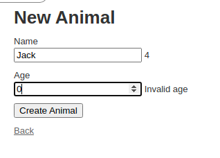

# Rails Stimulus

This project was built to test how to add Stimulus JS on a Rails application to manipulate the DOM using Stimulus controllers, targets, actions and, values.
It performs a counter on when the animal name is typed and, validate the animal age

Built with [Ruby on Rails](https://rubyonrails.org/) framework and,
 [Stimulus JS](https://github.com/hotwired/stimulus).



## Live version

[Rails Stimulus](http://rails-stimulus.herokuapp.com/)

## Prerequisites

- Ruby v2.7.0
- Ruby on Rails v6.1.3
- Stimulus JS 2.0.0
- Git

In order to clone the repository, please follow this instructions

- Install Git following the instructions available at [Git](https://git-scm.com/downloads) 
- Install Ruby following the instructions available at [Ruby](https://www.ruby-lang.org/en/documentation/installation/)

## Getting Started

To get a local copy up and running follow these simple example steps.

## Clone the repository

```
   git clone git@github.com:marcelomaidden/railsstimulus.git
   cd railsstimulus
```

### Setup

Install gems with:

```
   bundle install
```

Setup database with:

```
   rails db:create
   rails db:migrate
   rails db:seed
```
Install JavaScript packages 

`yarn install --check-files`

### Usage

Start server with:

```
    rails server
```

Open up your application on your preferred browser

```
   http://localhost:3000
```

👤 **Marcelo Fernandes**

- GitHub: [@marcelomaidden](https://github.com/marcelomaidden)
- Twitter: [@marcelomaidden](https://twitter.com/marcelomaidden)
- LinkedIn: [Marcelo Fernandes](https://linkedin.com/in/marcelofernandesdearaujo)

## Acknowledments
- Ruby on Rails and Stimulus JS creators

## 🤝 Contributing

Contributions, issues and feature requests are welcome!

Feel free to check the [issues page](https://github.com/marcelomaidden/railsstimulus/issues/).

## Show your support

Give a ⭐️ if you like this project!
